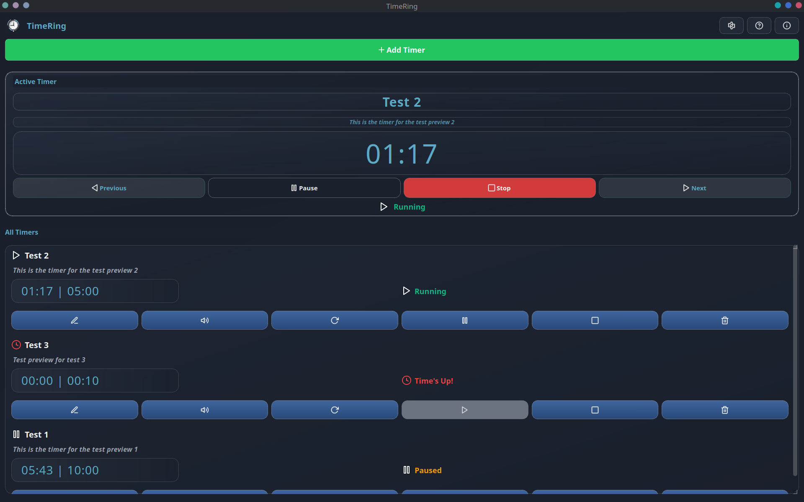

# TimeRing ⏰

<div align="center">
  
  
  **A lightweight, modern, and beautiful timer application for your desktop.**

  <br>
  
  [](https://github.com/Lusan-sapkota/TimeRing)
  [](https://www.python.org/)
  [](LICENSE)
  [](#platform-compatibility)

  <br>
  
  [**📥 Download**](https://sourceforge.net/projects/timering/) • 
  [**🐙 GitHub**](https://github.com/Lusan-sapkota/TimeRing) • 
  [**📖 Documentation**](#-usage-guide) • 
  [**🐛 Report Issues**](https://github.com/Lusan-sapkota/TimeRing/issues)
</div>

<br>

<div align="center">
  
</div>

<br>

## Table of Contents

- [Why TimeRing?](#-why-timering)
- [Features](#-features)
- [Quick Start](#-quick-start)
- [Usage Guide](#-usage-guide)
- [Managing Active Timers](#-managing-active-timers)
- [Timer States & Visual Indicators](#-timer-states--visual-indicators)
- [Active Timer Block](#-active-timer-block)
- [Settings & Customization](#-settings--customization)
- [Advanced Configuration](#-advanced-configuration)
- [Platform Compatibility](#-platform-compatibility)
- [Contributing](#-contributing)
- [Roadmap](#-roadmap)
- [Support](#-support)
- [License](#-license)
- [Author](#-author)
- [Acknowledgments](#-acknowledgments)

## 🌟 Why TimeRing?

TimeRing transforms how you manage time on your desktop. Whether you're following the Pomodoro Technique, timing cooking recipes, or managing multiple work sessions, TimeRing provides an intuitive and powerful solution that stays out of your way while keeping you on track.

<div align="center">

### **Perfect for:**

</div>

<div align="center">
<table>
<tr>
<td align="center">🍅<br><b>Pomodoro Technique</b><br>practitioners</td>
<td align="center">👨‍💻<br><b>Developers</b><br>managing sprint tasks</td>
<td align="center">🍳<br><b>Cooking</b><br>enthusiasts</td>
<td align="center">📚<br><b>Students</b><br>using time-blocking</td>
<td align="center">🏃‍♂️<br><b>Fitness</b><br>interval training</td>
</tr>
</table>
</div>

---

## ✨ Features

<div align="center">
<table>
<tr>
<td width="50%">

### 🎯 Core Timer Management
- **Multiple Concurrent Timers** - Run unlimited timers simultaneously without interference
- **Priority Timer System** - Most important timer always displayed prominently at the top
- **Active Timer Block** - Large, dedicated display with enhanced controls for your current focus
- **Smart Timer Navigation** - Seamlessly switch between multiple running timers
- **Custom Names & Descriptions** - Personalize each timer with meaningful labels and detailed notes

### 🔊 Smart Notifications
- **Custom Notification Sounds** - Assign unique audio alerts for different timer types
- **Continuous Audio Alerts** - Sounds loop until acknowledged, ensuring you never miss an alert
- **Native Desktop Integration** - Works seamlessly with KDE, GNOME, and other Linux desktop environments
- **Configurable Urgency Levels** - Set notification priority from low to critical

</td>
<td width="50%">

### 🎨 Modern User Experience
- **Clean, Intuitive Interface** - Thoughtfully designed with smooth animations and slide-in menus
- **System-Native Icons** - Automatically uses your system's icon theme for consistency
- **Responsive Design** - Adapts beautifully to different screen sizes, including 720p displays
- **Real-Time Status Updates** - Clear visual feedback for running, paused, ringing, and finished states

### ⚙️ Advanced Capabilities
- **Persistent State Management** - Automatically saves and restores timers across application restarts
- **Flexible Timer Controls** - Pause, resume, stop, and instantly rerun any timer
- **Auto-Update System** - One-click updates when new versions are available
- **CLI Support** - Basic command-line arguments for automation and scripting
- **Customizable Styling** - Modify appearance using Qt's QSS stylesheet system
- **Smooth Performance** - Optimized scrolling and non-blocking UI for fluid interaction

</td>
</tr>
</table>
</div>

---

## 🚀 Quick Start

### 📦 Easy Installation (Recommended)

<div align="center">
<table>
<tr>
<td align="center" width="50%">
<h4>🐧 Ubuntu/Debian (GitHub)</h4>

<details>
<summary><strong>Install from GitHub Release (.zip)</strong></summary>

```bash
# Download and extract the release zip from GitHub
wget https://github.com/Lusan-sapkota/TimeRing/releases/download/v1.0.0/Application.zip
unzip Application.zip

# Inside the extracted folder, you'll find TimeRing_1.0.0.deb
sudo dpkg -i TimeRing_1.0.0.deb

# Launch the app
timering
```
</details>

<details>
<summary><strong>Uninstall (.deb package)</strong></summary>

```bash
sudo dpkg -r timering
```
</details>

</td>
<td align="center" width="50%">
<h4>📁 Direct .deb Download (SourceForge)</h4>

<p>
<strong>Prefer a direct .deb file?</strong><br>
SourceForge hosts the latest .deb package for easy installation:
</p>

[](https://sourceforge.net/projects/timering/files/TimeRing_1.0.0.deb/download)

<details>
<summary><strong>Install from SourceForge (.deb)</strong></summary>

```bash
# Download the .deb package directly
wget https://sourceforge.net/projects/timering/files/TimeRing_1.0.0.deb/download

# Install
sudo dpkg -i TimeRing_1.0.0.deb

# Launch
timering
```
</details>

<details>
<summary><strong>Uninstall (.deb package)</strong></summary>

```bash
sudo dpkg -r timering
```
</details>

</td>
</tr>
</table>
</div>

### 🛠️ Manual Installation

<details>
<summary><strong>🔧 Click to expand manual installation instructions</strong></summary>

<br>

#### Prerequisites
```bash
# Ubuntu/Debian
sudo apt update && sudo apt install python3 python3-pip git

# Fedora/RHEL
sudo dnf install python3 python3-pip git

# Arch Linux
sudo pacman -S python python-pip git
```

#### Installation Steps
```bash
# 1. Clone the repository
git clone https://github.com/Lusan-sapkota/TimeRing.git
cd TimeRing

# 2. Create virtual environment
python3 -m venv venv
source venv/bin/activate

# 3. Install dependencies
pip install -r requirements.txt

# 4. Run the application
python3 main.py
```

</details>

---

## 📚 Usage Guide

### 🎯 Creating Your First Timer

<div align="center">
<table>
<tr>
<td align="center" width="25%">
<h4>1️⃣ Enter Details</h4>
Give your timer a meaningful name<br>
<i>(e.g., "Work Session", "Tea Brewing")</i>
</td>
<td align="center" width="25%">
<h4>2️⃣ Set Duration</h4>
Set time in hours, minutes, seconds anything you want<br>
<i>(or simply use the quick time)</i>
</td>
<td align="center" width="25%">
<h4>3️⃣ Add Description</h4>
Click the icon to add<br>
max 50 words description <i>(optional)</i>
</td>
<td align="center" width="25%">
<h4>4️⃣ Choose Sound</h4>
Click the icon to select<br>
custom sound, can be customized per timer or global deafult <i>(optional)</i>
</td>
</tr>
</table>
</div>

<div align="center">
<h4>5️⃣ Start Timer</h4>
Click <b>"Create Timer"</b> and watch it appear in your active timers list
</div>

### 🎮 Managing Active Timers

Each timer card displays comprehensive information and controls:

<div align="center">
<table>
<tr>
<td width="50%">

#### 📋 Timer Information
- **Timer Name & Icon** - Always visible, with status-specific icons
- **Description** - Optional details shown below the name
- **Time Display** - Shows remaining time and original duration
- **Status Row** - Clear icon and text indicators

</td>
<td width="50%">

#### 🎛️ Available Controls
- **Edit** - Change timer name and description
- **Change Sound** - Select custom notification sound
- **Pause/Resume** - Toggle timer state
- **Rerun** - Restart timer from original duration
- **Stop** - Halt timer and silence alarms

</td>
</tr>
</table>
</div>

### 🎨 Timer States & Visual Indicators

<div align="center">

<table>
<tr>
<th>State</th>
<th>Icon</th>
<th>Color</th>
<th>Available Actions</th>
</tr>
<tr>
<td align="center"><b>Running</b></td>
<td align="center"></td>
<td align="center" style="color: #4CAF50;">Green</td>
<td>Pause, Stop, Edit, Change Sound</td>
</tr>
<tr>
<td align="center"><b>Paused</b></td>
<td align="center"></td>
<td align="center" style="color: #FF9800;">Orange</td>
<td>Resume, Stop, Edit, Change Sound</td>
</tr>
<tr>
<td align="center"><b>Ringing</b></td>
<td align="center"></td>
<td align="center" style="color: #F44336;">Red</td>
<td>Stop (to silence)</td>
</tr>
<tr>
<td align="center"><b>Time's Up</b></td>
<td align="center"></td>
<td align="center" style="color: #FF5722;">Red</td>
<td>Rerun, Edit, Delete</td>
</tr>
</table>
</div>

> **💡 Pro Tip:** Icons provide instant visual feedback - look for the color-coded status indicators to quickly understand your timer states at a glance!

### 🎯 Active Timer Block

The large, dedicated display at the top shows your current focus timer:

<div align="center">
<table>
<tr>
<td width="50%">

#### 📊 Display Elements
- **Timer Name & Description** - Centered, always visible
- **Large Time Display** - Easy-to-read countdown
- **Status Row** - Centered icon and text
- **Automatic Priority** - Most important timer shown

</td>
<td width="50%">

#### 🎛️ Enhanced Controls
- **Previous/Next** - Switch between running timers
- **Pause/Resume** - Toggle timer state
- **Stop** - Halt timer and silence alarms
- **Quick Access** - All controls in one place

</td>
</tr>
</table>
</div>

### ⚙️ Settings & Customization

Access powerful configuration options through the header icons:

<div align="center">
<table>
<tr>
<td align="center" width="33%">
<h4>🛠️ Settings</h4>
• Global default notification sound<br>
• Desktop notifications toggle<br>
• Auto-start timers on launch<br>
• Notification urgency levels<br>
• Update checks & sound looping
</td>
<td align="center" width="33%">
<h4>❓ Help</h4>
• User guide & tutorials<br>
• Troubleshooting tips<br>
• Keyboard shortcuts<br>
• Feature explanations<br>
• Best practices
</td>
<td align="center" width="33%">
<h4>ℹ️ About</h4>
• Version information<br>
• Developer details<br>
• System compatibility<br>
• License information<br>
• Credits & acknowledgments
</td>
</tr>
</table>
</div>

---

## 🛠️ Advanced Configuration

### 📁 Configuration Files

TimeRing stores all settings in your home directory:

```
~/.config/TimeRing/
├── settings.json     # Application preferences and defaults
└── timers.json       # Current timer states (auto-saved)
```

### 🎨 Custom Styling

Personalize TimeRing's appearance by modifying `style.qss`:

```css
/* Modern button styling */
QPushButton#startButton {
    background-color: #4CAF50;
    border-radius: 8px;
    padding: 8px 16px;
    font-weight: bold;
}

/* Custom timer card appearance */
QFrame#timerCard {
    background-color: #f5f5f5;
    border: 1px solid #e0e0e0;
    border-radius: 6px;
    margin: 4px;
}

/* Dark theme support */
QMainWindow {
    background-color: #2b2b2b;
    color: #ffffff;
}
```

### ⌨️ Command Line Options

<div align="center">
<table>
<tr>
<td width="50%">

```bash
# Start minimized to system tray
python3 main.py --minimized

# Load custom style sheet
python3 main.py --style custom.qss
```

</td>
<td width="50%">

```bash
# Enable debug logging
python3 main.py --debug

# Set custom config directory
python3 main.py --config-dir ~/.timering
```

</td>
</tr>
</table>
</div>

---

## 🖥️ Platform Compatibility

<div align="center">
<table>
<tr>
<td align="center" width="50%">

### 🐧 **Primary Platform: Linux**

**Supported Distributions:**
- Ubuntu 20.04+ / Debian 11+
- Fedora 34+ / RHEL 8+
- Arch Linux / Manjaro
- openSUSE Leap 15.3+

</td>
<td align="center" width="50%">

### 🖥️ **Desktop Environments**

**Fully Tested:**
- KDE Plasma 5.20+
- GNOME 3.38+
- XFCE 4.16+
- Cinnamon 5.0+

</td>
</tr>
</table>
</div>

> **🔧 Windows/macOS Support:** While TimeRing may run on other platforms with Python and PyQt5, some features (particularly desktop notifications and audio) are optimized for Linux and may require additional configuration.

---

## 🤝 Contributing

We welcome contributions from the community! Here's how you can help make TimeRing even better:

<div align="center">
<table>
<tr>
<td align="center" width="20%">
<h4>🐛 Report Bugs</h4>
<a href="https://github.com/Lusan-sapkota/TimeRing/issues">GitHub Issues</a>
</td>
<td align="center" width="20%">
<h4>💡 Suggest Features</h4>
<a href="https://github.com/Lusan-sapkota/TimeRing/discussions">Discussions</a>
</td>
<td align="center" width="20%">
<h4>🔧 Submit PRs</h4>
<a href="https://github.com/Lusan-sapkota/TimeRing/pulls">Pull Requests</a>
</td>
<td align="center" width="20%">
<h4>📖 Improve Docs</h4>
<a href="https://github.com/Lusan-sapkota/TimeRing/wiki">Wiki</a>
</td>
<td align="center" width="20%">
<h4>🌍 Translate</h4>
<a href="https://github.com/Lusan-sapkota/TimeRing/tree/main/translations">i18n</a>
</td>
</tr>
</table>
</div>

### 🚀 Development Setup

```bash
# 1. Fork and clone your repository
git clone https://github.com/Lusan-sapkota/TimeRing.git
cd TimeRing

# 2. Create development environment
python3 -m venv dev-env
source dev-env/bin/activate

# 3. Install dependencies
pip install -r requirements.txt

# 4. Run tests (optional)
python -m pytest tests/

# 5. Start developing!
python3 main.py
```

### 📋 Pull Request Guidelines

1. **Fork** the repository and create a feature branch
2. **Write** clear, commented code following PEP 8
3. **Add tests** for new functionality
4. **Update** documentation as needed
5. **Submit** a pull request with a clear description

---

## 📈 Roadmap

<div align="center">
<table>
<tr>
<td width="50%">

### 🎯 **Upcoming Features**
While active development may be limited, maintenance updates and essential patches will be provided as needed to ensure continued stability and usability.

</td>
<td width="50%">

### 📝 **Version History**
- **v1.0.0** - Initial release with core timer functionality

</td>
</tr>
</table>
</div>

---

## 🆘 Support

### 🔍 Getting Help

<div align="center">
<table>
<tr>
<td align="center" width="33%">
<h4>📖 Documentation</h4>
Check this README and<br>
<a href="https://github.com/Lusan-sapkota/TimeRing/wiki">project wiki</a>
</td>
<td align="center" width="33%">
<h4>💬 Community</h4>
Join our <a href="https://github.com/Lusan-sapkota/TimeRing/discussions">GitHub Discussions</a>
</td>
<td align="center" width="33%">
<h4>🐛 Bug Reports</h4>
Use our <a href="https://github.com/Lusan-sapkota/TimeRing/issues">Issue Tracker</a>
</td>
</tr>
</table>
</div>

### 🔧 Common Issues

<details>
<summary><b>🔊 Audio notifications not working</b></summary>

<br>

Ensure VLC is installed:
```bash
# Ubuntu/Debian
sudo apt install vlc

# Fedora
sudo dnf install vlc

# Arch Linux
sudo pacman -S vlc
```

</details>

<details>
<summary><b>🔔 Desktop notifications not showing</b></summary>

<br>

Check that `libnotify` is installed:
```bash
# Ubuntu/Debian
sudo apt install libnotify-bin

# Fedora
sudo dnf install libnotify

# Test notifications
notify-send "Test" "This is a test notification"
```

</details>

<details>
<summary><b>🐍 Python version compatibility</b></summary>

<br>

TimeRing requires Python 3.11+. Check your version:
```bash
python3 --version

# If needed, install Python 3.11+
sudo apt install python3.11
```

</details>

---

## 📄 License

This project is licensed under the **MIT License** - see the [LICENSE](LICENSE) file for details.

---

## 👨‍💻 Author

<div align="center">
<table>
<tr>
<td align="center">
<br>
<b>Lusan Sapkota</b><br>
<i>Software Developer & Creator</i>
</td>
</tr>
</table>

[](https://github.com/Lusan-sapkota)
[](mailto:sapkotalusan@gmail.com)
[](https://www.lusansapkota.com.np)

</div>

---

## 🙏 Acknowledgments

<div align="center">
<table>
<tr>
<td align="center" width="25%">
<h4>🛠️ Technology</h4>
PyQt5 community for the<br>excellent GUI framework
</td>
<td align="center" width="25%">
<h4>🤝 Contributors</h4>
All contributors who have<br>helped improve TimeRing
</td>
<td align="center" width="25%">
<h4>🧪 Testing</h4>
Beta testers who provided<br>valuable feedback
</td>
<td align="center" width="25%">
<h4>🎨 Design</h4>
Icon designers for<br>beautiful system icons
</td>
</tr>
</table>
</div>

---

<div align="center">
<h2>⭐ Star this repository if TimeRing helps you manage your time better!</h2>

<p><i>Made with ❤️ for productivity enthusiasts</i></p>

<br>

[](https://github.com/Lusan-sapkota/TimeRing/issues)
[](https://github.com/Lusan-sapkota/TimeRing/discussions)
[](https://github.com/Lusan-sapkota/TimeRing/blob/main/CONTRIBUTING.md)

</div>